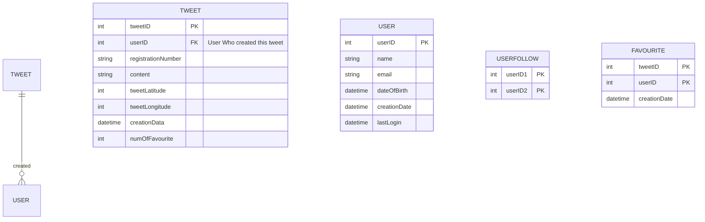

>[!IMPORTANT]- What are the things we should consider, when proposed with a software design challenge?
> 	When faced with a software design question, our first goal SHOULD be `to Understand the User/Business Requirement` in detail, without leaving anything in doubt.

## Understanding the System


- ### What is the goal of our application?
    - The main goal of twitter is to help people, organisation and government to share their view on certain topics. Our goal is to design a system keeping above thing + statistics tracking in mind.


- ### Whats expected from system? (aka Functional Requirement)
	- To share user view on certain topics. Our system need the following:
	- Ability to upload text message of 150 char long.
	- Facility to upload image expressing their view.
	- Facility to upload video file expressing their view.
	- Registered user can `post, read, follow, re-tweet`. While unregistered user can only read the tweet.
	- User is provided option to mark tweet as `favourite`, `re-tweet` a tweet, `follow` other user.
	- <abbr title="aka timeline can be generated in many ways, most used is to generate tweet from all the user which the current user follow.">User homepage consist of a series of tweet.</abbr>

- ### How the system should behave? (aka non-functional requirement)
	- Recalling [[CAP]] theorem. We can either make system Available or Consistent. ==As twitter design is an example of non-critical data. We do not need high consistent data. i.e we should design highly available system.==
	- Application open time `i.e timeline generation` should be done within accepted latency. ~ $$ 1/10 sec == 200ms$$(We do not need to define the number during actual interview. But in personal discussion we should know how much is [[Acceptable Latency]] w.r.t user perspective)


- ### Extended Requirements
	- Ability to tag other user while posting tweet.
	- Ability to search tweet.
	- Reply option for tweet post. (reply to a tweet)
	- `Trending Topic` 
	- Follow suggestion?
	- Tweet Notification to APP/Mobile Number/Email?
	- `Twitter Moments` to visualise about what's happening about that topic/person/country etc.


## System API
>[!IMPORTANT]- What is API?
>API can be though as a way to connect **two** <ins>closed software space</ins> (aka Application code).
> ![[API_Diagram.drawio.png]]
>
>Connecting software code via API gives us flexibility to change code in one system without affecting the code in other system. (in shorts its keeps Application code modular)

```c++
string tweet(string location,string userID,string tweetText,mediaID[])
```
**mediaID[] :** List of optional media to be associated with the current tweet.
**return value :** url to access the tweet


## HDL to LLD Evolution during discussion

### HDL
---


>[!IMPORTANT]- Explanation of above system.
> **Application Server:** All request to access our system will be generated at <ins>twitter mobile application</ins> or <ins>twitter web-application</ins>.
>> **Load Balancer:** Since we are launching the service word-wide(or even for a small scale we will target one country at least), we need a way to distribute all the incoming request to available Application Server. <= We will use [Load Balancer]() to distribute the incoming request.
>
> **Relational DB:** We need a Relational DB that can store all the new tweets and can support a huge number of reads.
>
> **File Storage:** To store store photos and videos we need file storage.
>
>**Traffic Estimation:** We must be able to deduce beforehand that our system is `read-heavy`.  
When desigining our system, we **must** keep it in mind. ==From Here Branch out to Capacity Estimation if estimation is prompted==
>
>**Maximium Strain in System:** To-DO: Please calculate the maximum read and write request that should be served, once you know your target user count.

## Database Design
Data that will be storage in file storage: video,photo
Data that will be stored in Relations DB: 

### Schema for relational database




	


